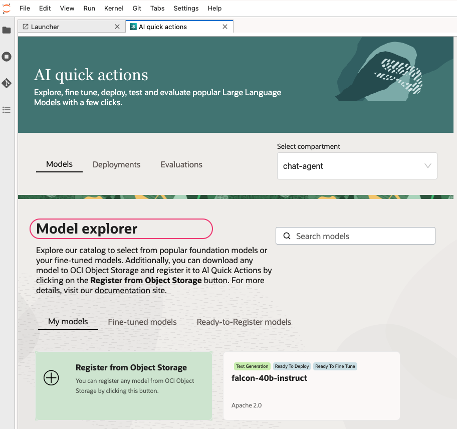
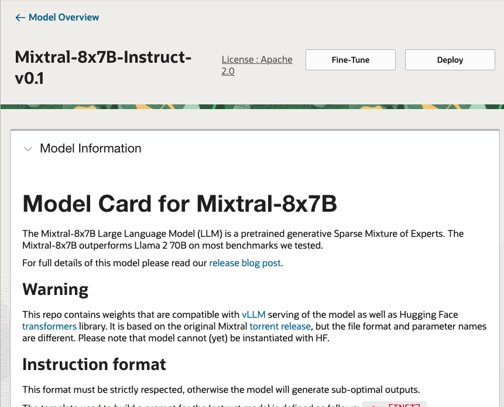
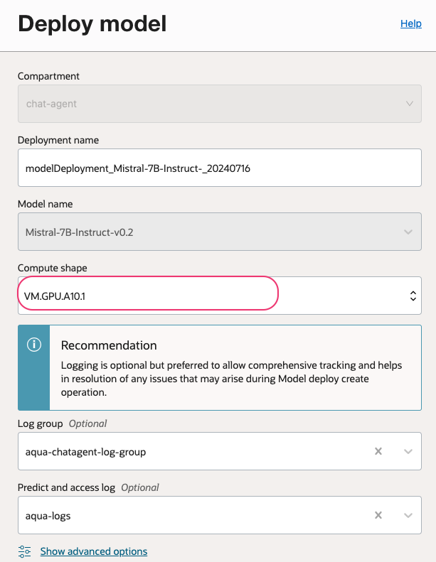
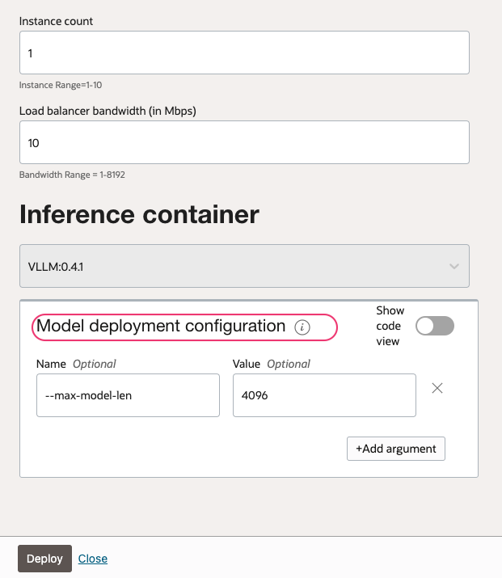
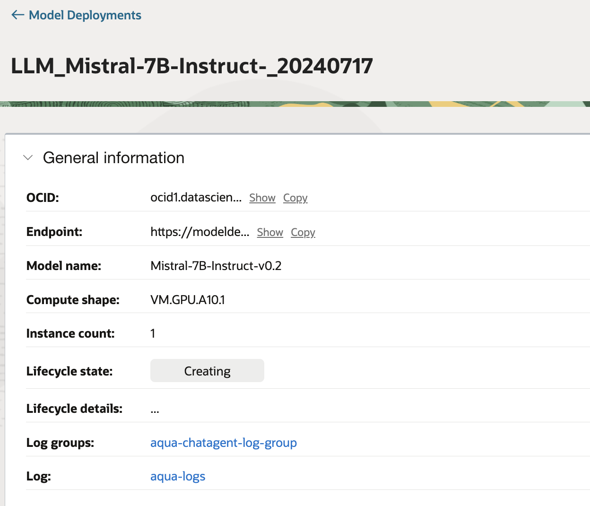
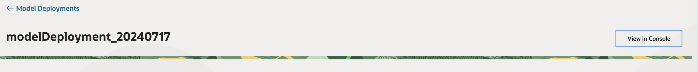
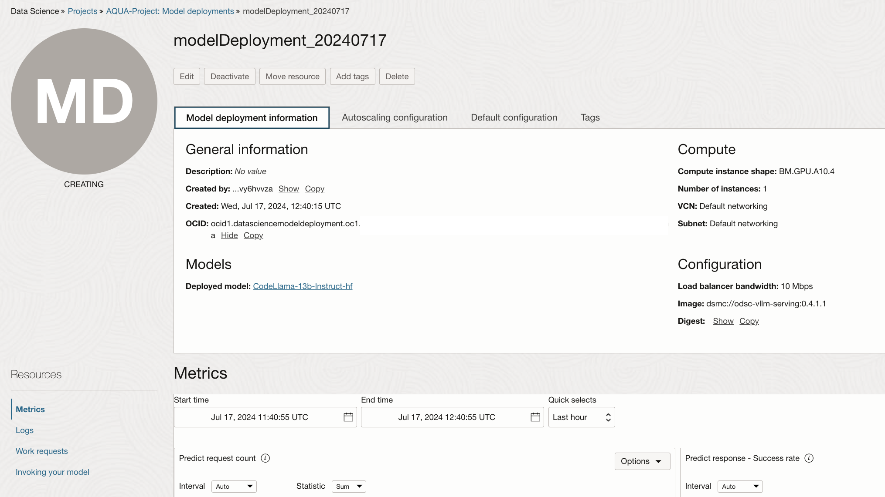
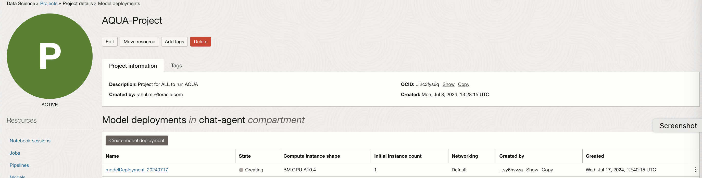

### Deploy models using OCI AI Quick actions.

Under Models, you can find Model Explorer that shows all the foundation models supported by AI Quick Actions and your fine-tuned models. Under My models are service curated foundation models and models you have registered. Under Fine-tuned models are models you have fine-tuned. Under Ready-to-register models are models you can bring from Object Storage and register in AI Quick Actions.

##### Curated Models
Curated models have been tested by Data Science and the model artifacts are downloaded to a bucket in the service's object storage. They are ready to be used.

##### Ready-to-Register Models
Ready-to-Register models have been tested by Data Science, but the model artifacts must be downloaded to your Object Storage bucket and brought in to AI Quick Actions through the Model Registration process before they can be used.

#### Deploy a Curated model.

- From AI quick actions > `Models` > Click on model card

- Refer `README` for more details about the curated model. click `Deploy`

- Select desired `Compute shape` , `Log group` and `Log name`

- you may use `advanced options` to update details and can add parameters according to the inference containers (vLLM,TGI etc)

- Wait for the model deployment to complete.

- You may use `View in Console` option to see the process in details.

- It may take several minutes (at least 5 to 7 mnts for a baremetal-based deployment) to complete the deployments

- Please note that you will not be able to view or use the instance directly from the tenancy, as its deployed and securely served from OCI service managed tenancies.Respective GPU count limit will be used from User tenancy and the cost will be charged accordingly.

#### Read more 
[Read more.](https://github.com/oracle-samples/oci-data-science-ai-samples/blob/main/ai-quick-actions/model-deployment-tips.md)

[⬅️ Notebooks](notebook.md)[🏠 Back to Home](../README.md) [➡️ Register and use models](register_use_model.md)