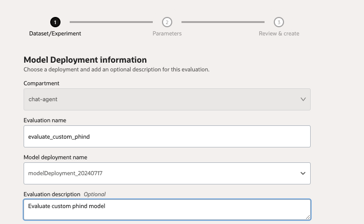
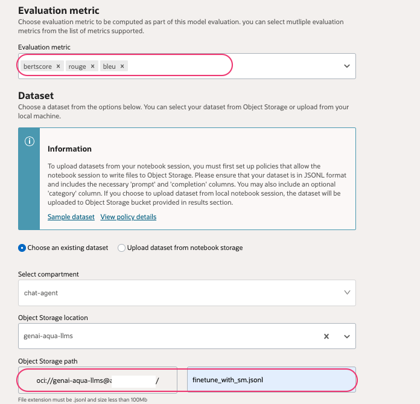
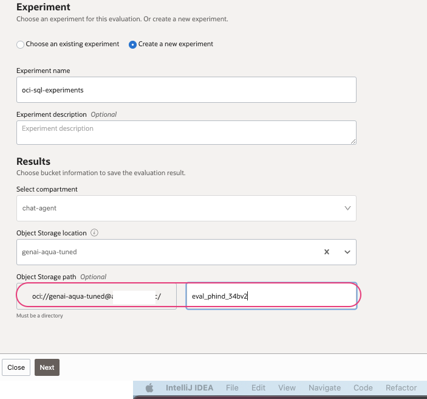
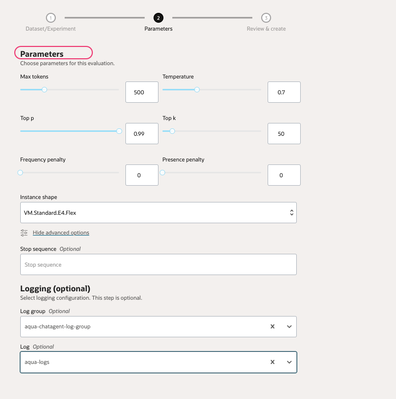
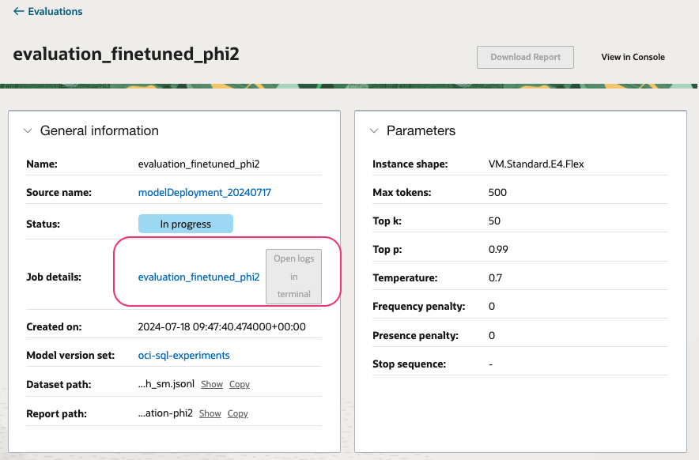
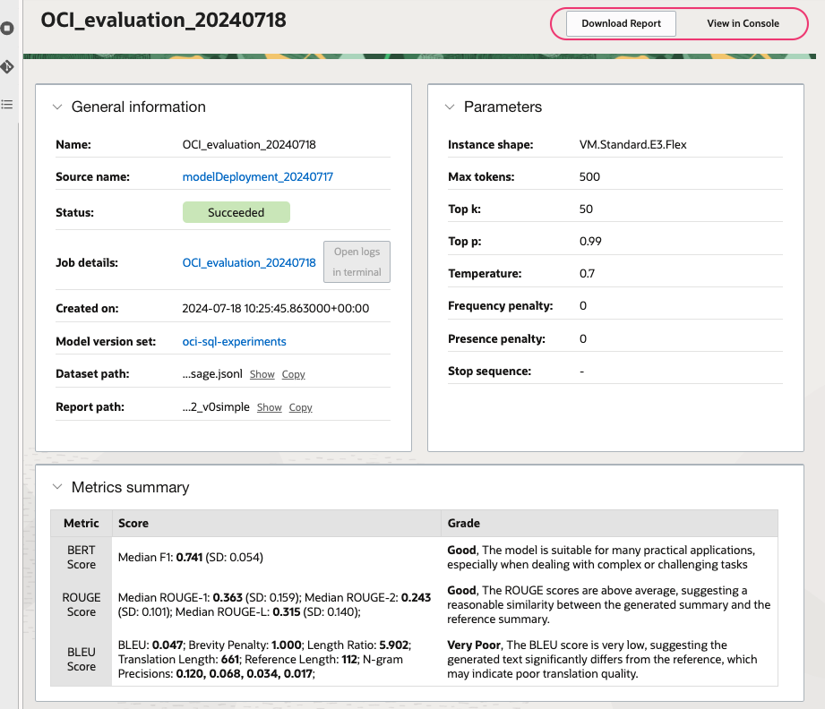
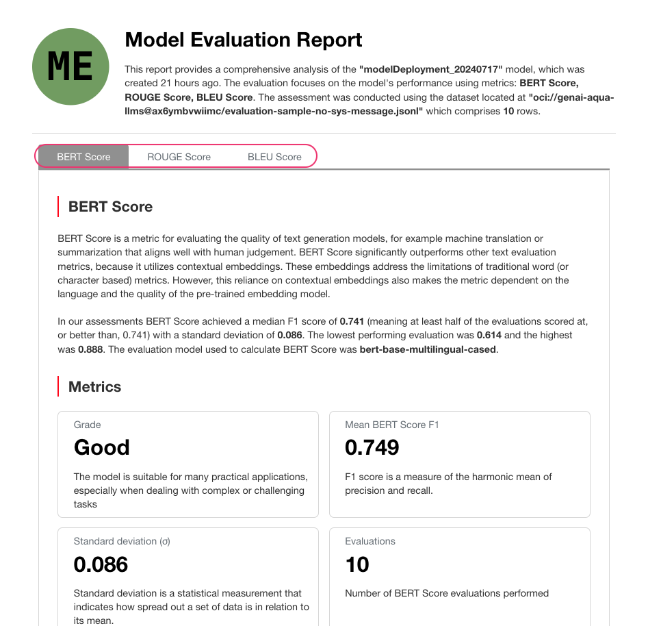

### Evaluate a deployed model using AI Quick actions.

The primary evaluation metric used by AI Quick Actions is BERTScore. This embedding-based metric assesses the semantic similarity between words in the model's response and the reference, rather than focusing on token-level syntactic similarity.

BERTScore aligns closely with human judgement. A model targeting text generation will likely score highly on BERTScore if it produces results that humans deem high-quality. For example, the following sentences are considered semantically similar:

"The cat quickly climbed up the tall tree to escape the pursuing dog." and "In an effort to evade the chasing canine, the feline ascended the lofty arboreal structure with speed." these sentences would receive low scores using BLEU or ROUGE due to the minimal overlap in words and phrases.

- OCI AI Quick actions > `Evaluations` > `Create evaluation`
- Provide name ,description and select an existing deployment.

- Select all the evaluation that we need.
- Upload an evaluation date set from object storage

- Create a or reuse an experiment name.
- Provide a bucket to store the output.

- Click `Next`
- During evaluation, it runs inference against the deployment to validate . You may update the parameters accordingly 

- Validate and submit. the job runs for a while and provides the evaluation.

- Once its completed , download the report to know more.

#### Read more 
[Evaluation tips](https://github.com/oracle-samples/oci-data-science-ai-samples/blob/main/ai-quick-actions/evaluation-tips.md)

[⬅️ Register and use model](register_use_model.md)[🏠 Back to Home](../README.md) [➡️ Read more about ADS](oci_ads.md)
