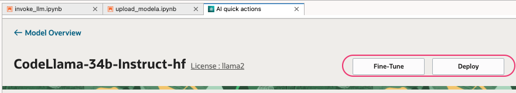
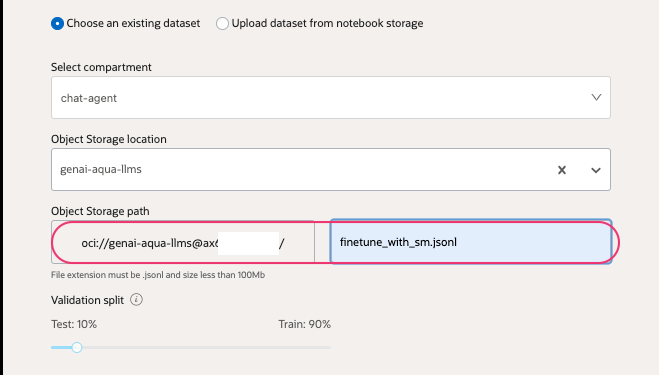
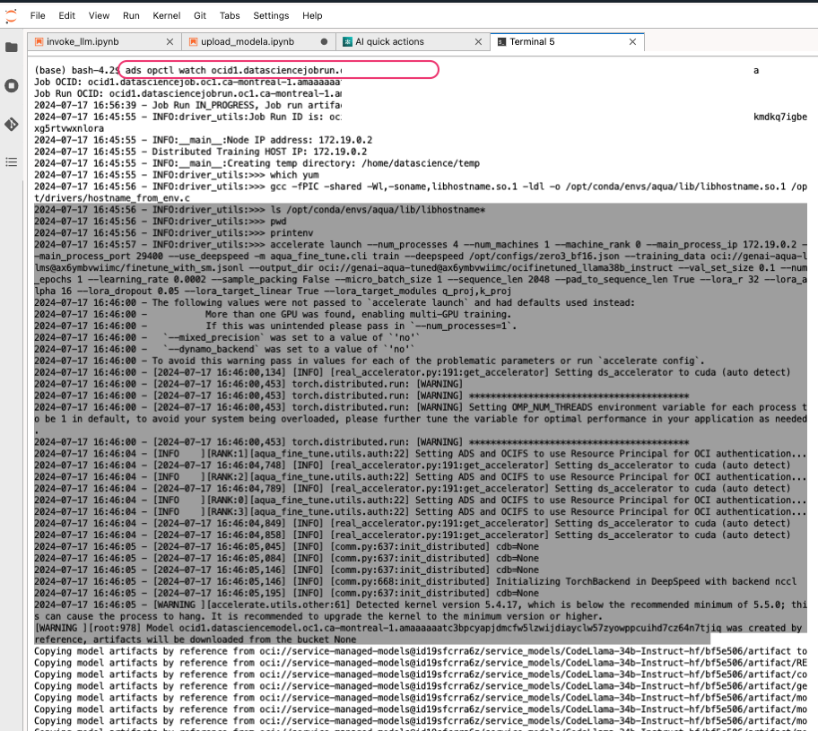

### Finetune a model using AI Quick actions.

Fine-tuning is the art of tailoring a pre-trained model to excel in specific tasks or domains. This customization is crucial because, despite their general proficiency, LLMs may not perform optimally on specialized tasks without further training. By fine-tuning an LLM on a domain-specific dataset, we can enhance its performance, making it more adept at understanding and responding to the nuances of that domain.

The primary method used by AI Quick Action for fine-tuning is Low-Rank Adaptation [LoRA](https://huggingface.co/docs/peft/main/en/conceptual_guides/lora). LoRA stands out as a parameter-efficient fine-tuning method that allows for the adaptation of pre-trained models to specific tasks without the need to retrain the entire model. This technique is particularly beneficial for those who wish to leverage the power of LLMs while operating within the constraints of limited computational resources.

- Upload sample [dataset](../files/finetune_with_sm.jsonl) to the object storage.
- OCI AI Quick actions > `Model explore` > Select a model to fine tune.
- Click `Fine-Tune`

- Provide a name and description.

- Select the `compartment` and `Object storage bucket` and the file name.

- Create a `Version set` to logically group models.

- Provide a bucket name (it can be the same bucket or another one) and path to store the fine-tuned model

- Select a desires `Instance shape`. If we select it will allows to select more than one replica. In such cases, we should provide Virtual cloud network and subnet to use as well as need to update policies to allow data science to use VCN family with in the compartment. If we are using Baremetal, it will allow us to use it with clustering

- Select a `Logging group` and `Log` created.
- Update any `Hyperparameters` if needed. Refer [more about advanced configuration here](https://github.com/oracle-samples/oci-data-science-ai-samples/blob/main/ai-quick-actions/fine-tuning-tips.md#advanced-finetuning-options)

- Click `Next` ,validate and `Submit` the job.

- Click `Open logs in terminal` to view the status of the finetune job. Upon clicking, it will open a new terminal and provide the job details.

- The fine tune jobs runs in the background, the status can be checked at any time via console or using terminal view.

- Once its finished the model will be available under `Fine-tuned models`

- You can refer the Metric panel to validate the training loss.

The accuracy metric reflects the proportion of correct completions made by the model on a given dataset. A higher accuracy indicates that the model is performing well in terms of making correct completions. On the other hand, the loss metric represents the model's error. It quantifies how far the model's completions are from the actual target completions. The goal during training is to minimize this loss function, which typically involves optimizing the model's weights to reduce the error on the training data.

As the training progresses, monitoring both accuracy and loss provides insights into the model's learning dynamics. A decreasing loss alongside increasing accuracy suggests that the model is learning effectively. However, it's important to watch for signs of over-fitting, where the model performs exceptionally well on the training data but fails to generalize to new, unseen data. This can be detected if the validation loss stops decreasing or starts increasing, even as training loss continues to decline.

#### Read more 
[Fine-tune tips](https://github.com/oracle-samples/oci-data-science-ai-samples/blob/main/ai-quick-actions/fine-tuning-tips.md)

