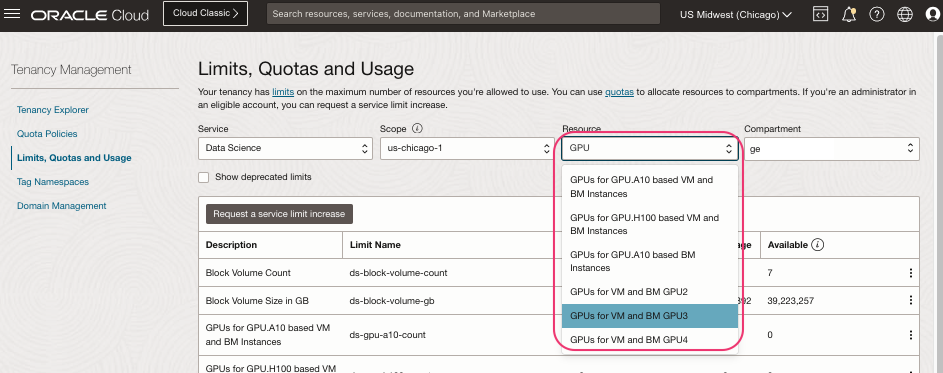
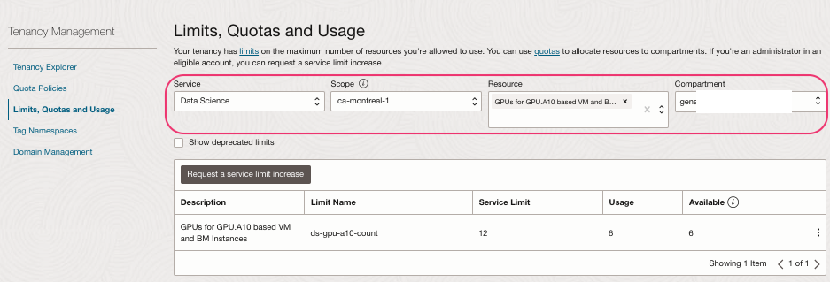

### Objective -Validate service limits.
- OCI Console > Tenancy Management > `Limits, Quotas and Usage`
- Ensure you are on the correct `OCI Region`.
  - Select `Data Science` as `Service`.
  - Select `Respective AD` as `Scope`.
  - Search for `GPU` as `Resource` and select the desired limits.
  - Select the `Tenancy name` as `Compartment`.




- Some of the common GPU limits are 

```shell
- GPUs for GPU.A10 based VM and BM Instances
- GPUs for GPU.H100 based VM and BM Instances
- GPUs for GPU.A100 based VM and BM Instances
```
#### Read more 
-[Data science service limits] (https://docs.oracle.com/en-us/iaas/Content/General/Concepts/servicelimits.htm#Data_Science_Limits)
- [Request service limit update](https://docs.public.oneportal.content.oci.oraclecloud.com/en-us/iaas/autonomous-database/doc/adbd-service-limit-increase.html)

[⬅️ Read Me](../README.md)[🏠 Back to Home](../README.md) [➡️ Policies](policies.md)
