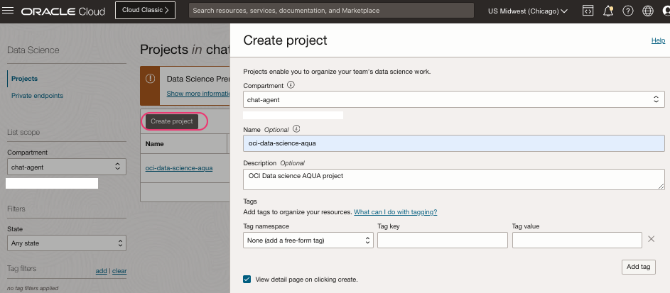
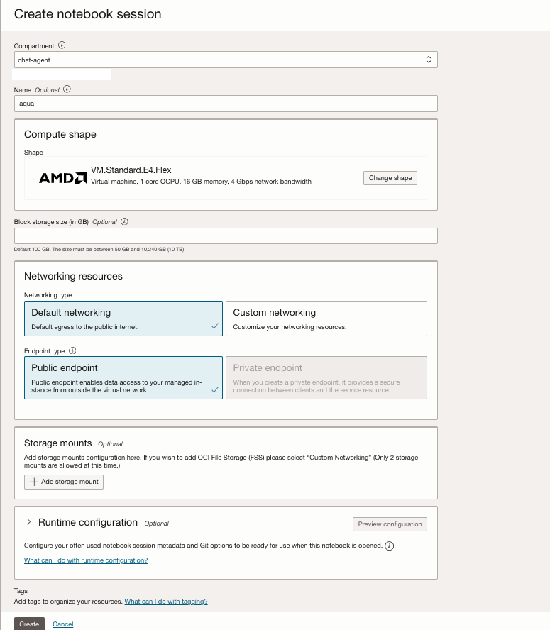
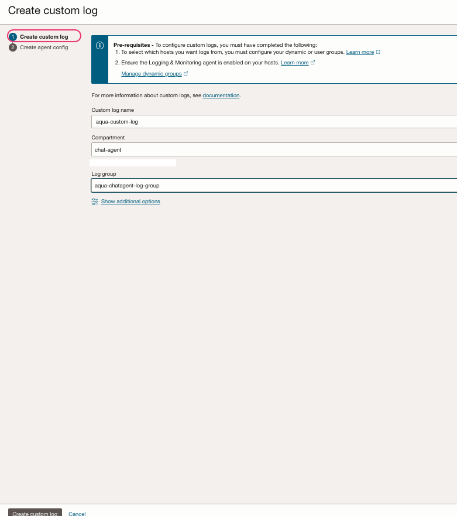

### Create Data science notebook.

- OCI Console > `Analytics & AI` > `Data Science`
- Click `Create project`.



- Create a `Notebook session`.




### Create a custom logs.
- OCI Console > `Logging` > `Create Log Group`


- Under the `Log Group` > `Create custom log`


- Skip `Agent configuration` and create the custom log.

### Validate the notebook sessions.

- Go back the `Data science` > `Project`>`Note book` > `Open`


- Use proper credentials and open the notebook.
- Validate that the notebook has `AI quick actions` extension.


- Click `Extend` to extend the sessions.

**ℹ️ Information**

```shell
If you have active notebooks created from before the release of AI quick actions, to access AI quick actions from them, deactivate and reactivate them. 
All notebooks created after the release of AI quick actions have AI quick actions available.
```

[⬅️ Policies](policies.md)[🏠 Back to Home](../README.md) [➡️ Deployments](deployments.md)