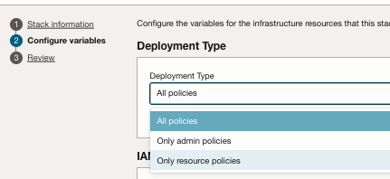
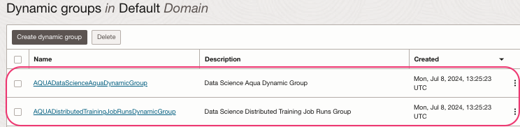
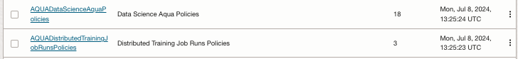

### Policies to use OCI AI Quick actions.

- AI Quick actions needs policies set at the `root` of the tenancies.Ensue the users with which we are executing below steps has necessary permissions to manage dynamic groups and policies  
- You may use OCI Stack to setup the policies - Details are [here.](https://docs.oracle.com/en-us/iaas/data-science/using/ai-quick-actions-policies.htm#ai-quick-actions-policies-terraform)

  - strongly recommend to use `All policies` option with the RMS Stack.

- Or You may set the policies manually - Details are [here.](https://docs.oracle.com/en-us/iaas/data-science/using/ai-quick-actions-policies.htm#ai-quick-actions-manually-add-policies)
- When we use OCI RMS to set the policies, it will create 2 dynamic groups and 2 policies.




- The Policies allows the AI quick actions to access other OCI resources via `resource principal` and allow to have cross tenancy access to consume the curated models from `service tenancies`
- Add below policies to one created (either by RMS stack or manual) to allow write access to object-storage for fine-tune operations.

```shell
Allow dynamic-group id <OCID of Dynamic group which has resource types as `datasciencenotebooksession`, `datasciencemodeldeployment` and `datasciencejobrun`> to manage object-family in compartment id <OCID of the OCI Compartment>
```
#### Read more
[Details about policies.](https://github.com/oracle-samples/oci-data-science-ai-samples/tree/main/ai-quick-actions/policies)

[⬅️ Limits](limits.md)[🏠 Back to Home](../README.md) [➡️Notebooks](notebook.md)