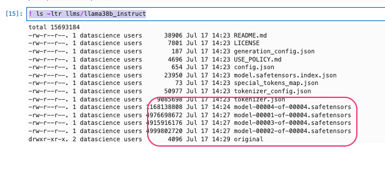
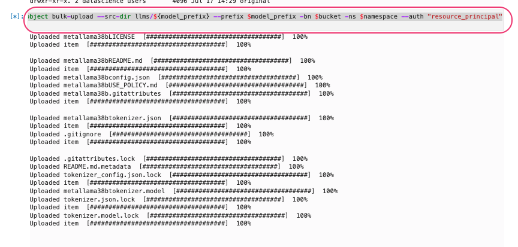

### Register and deployment model.

- Ensure to have a validated `Hugging Face token` to download the desired model
- Create an OCI Object storage bucket,enable `Enable Object Versioning`.
- Download and upload the model artifacts to object storage.


#### Register a verified model.
- OCI AI Quick actions > `Model explorer` > `Read-to-Register-models`
- Select your desired model.


- Download the desired model artifacts from `Hugging Face`
- Refer below where we are using a notebook to download and push to object storage. The same can perform from cloud shell or any other machines where we have proper access enabled by OCI CLI.

```python
HUGGINGFACE_TOKEN = "hf_xxxx"
!pip install huggingface-hub
!huggingface-cli login --token $HUGGINGFACE_TOKEN 
```


- Set certain variables.

```python
model_name = "meta-llama/Meta-Llama-3-8B-Instruct" #LLM PATH
model_prefix = "metallama38b" # A Prefix
bucket="OCI BUCKET"
namespace = "OCI BUCKET NAMESPACE"
```

- Download the model

```python
!huggingface-cli download meta-llama/Meta-Llama-3-8B-Instruct --local-dir llms/${model_prefix} --quiet
```


- Validate the files
```shell
! ls -ltr llms/llama38b_instruct
```



- Upload the files to object storage bucket.
```shell
!oci os object bulk-upload --src-dir llms/${model_prefix} --prefix $model_prefix -bn $bucket -ns $namespace --auth "resource_principal"
```

- Validate the files from object storage bucket.


