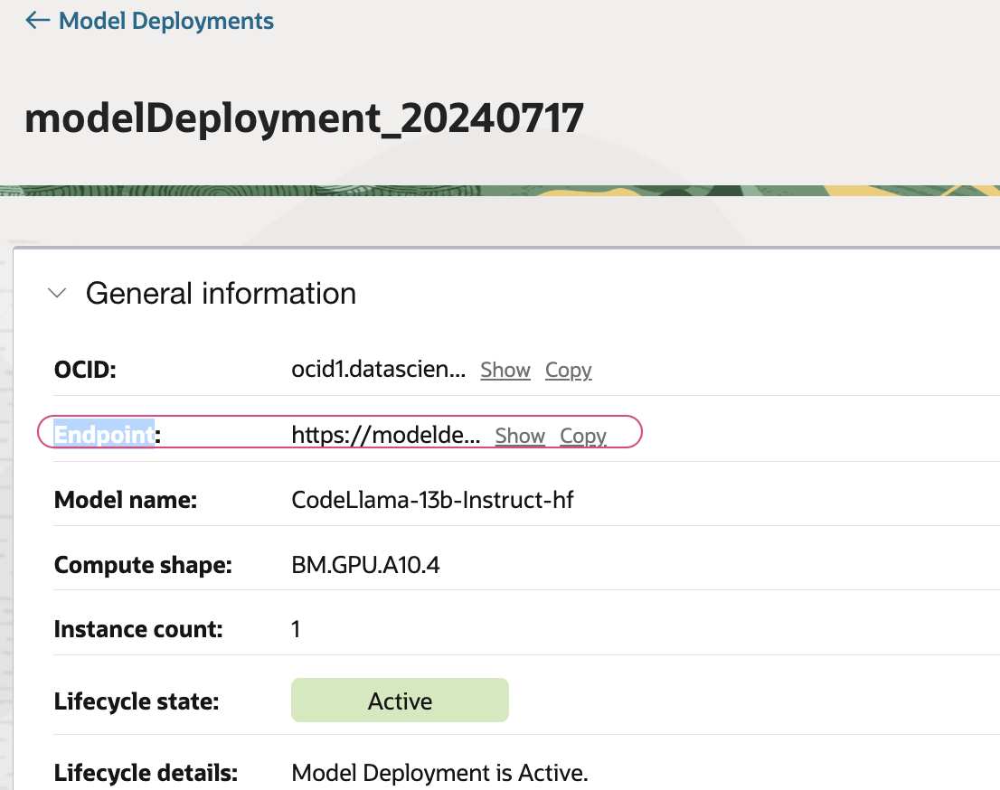

### How to use a deployed model.

#### Test model from Console.

- OCI AI Quick actions > `Deployments` > `Click on the Active deployment`
- Use `Test your model` to validate the model.You may adjust the model parameters accordingly
- Run a sample prompt as below 
```shell
Provide a summary about OCI AI Quick actions
```


#### Use the model programmatically 

- If the deployed model is a curated or registered model,you may click on the `code samples` to invoke the model


#### Use a notebook and invoke the model endpoint.
- Make a note of model endpoint.



- Create a new notebook.
- Use below reference and execute the notebook.
```python
import requests
import ads
from string import Template

ads.set_auth("resource_principal")
model_endpoint="https://modeldeployment.<OCIREGION>.oci.customer-oci.com/ocid1.datasciencemodeldeployment.oc1.<OCI REGION>.<ID>"
requests.post(
    f"{model_endpoint}/predict",
    json={
        "model": "odsc-llm",#Static value
        "prompt": Template(
            """"|begin_of_text|><|start_header_id|>user<|end_header_id|> $prompt <|eot_id|><|start_header_id|>assistant<|end_header_id|>"""
        ).substitute(
            prompt="Provide a sample SQL query to join elements from two tables?"
        ),
        "max_tokens": 1000,
        "temperature": 0.7,
        "top_p": 0.8,
    },
    auth=ads.common.auth.default_signer()["signer"],
    headers={},
).json()
```


#### Read more
[Deployment using CLI/ Access via Notebook/Langchain](https://github.com/oracle-samples/oci-data-science-ai-samples/blob/main/ai-quick-actions/llama3-with-smc.md)

[⬅️ Deployments](deployments.md)[🏠 Back to Home](../README.md) [XXXX](use_deployed_model.md)